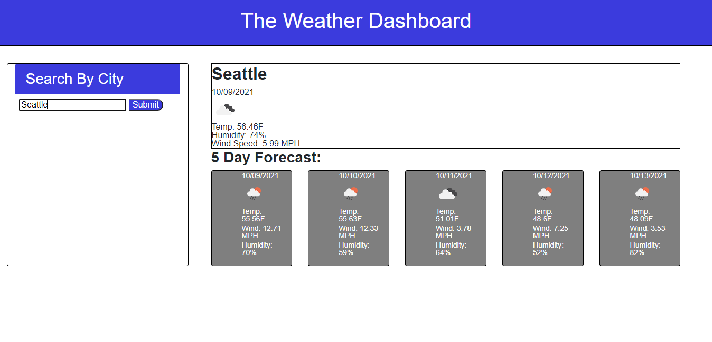

# 06 Server-Side APIs: Weather Dashboard

## Description

 A weather dashboard that runs in the browser and features dynamically updated HTML and CSS using the [OpenWeather One Call API](https://openweathermap.org/api/one-call-api) to retrieve weather data for cities. 

## User Story

```
AS A traveler
I WANT to see the weather outlook for multiple cities
SO THAT I can plan a trip accordingly
```

## Usage

```

1. I have created a weather dashboard with search input forms.

2. When the user searches for a city, they are presented with current a current forecast as well as a 5 Day Forecast for that city.

3. Current weather conditions show the city name, the date, an icon represenation of weather conditions, the temperature, humidity, and wind speed.

4. The 5 Day Forecast displays the date, an icon representation of weather conditions, temperature, wind speed and humidity.


```

## Screen Shot

The following image shows the web application's appearance and functionality:



## Links 
GitHub URL: https://chuck2076.github.io/Weather_Page_CRS/


