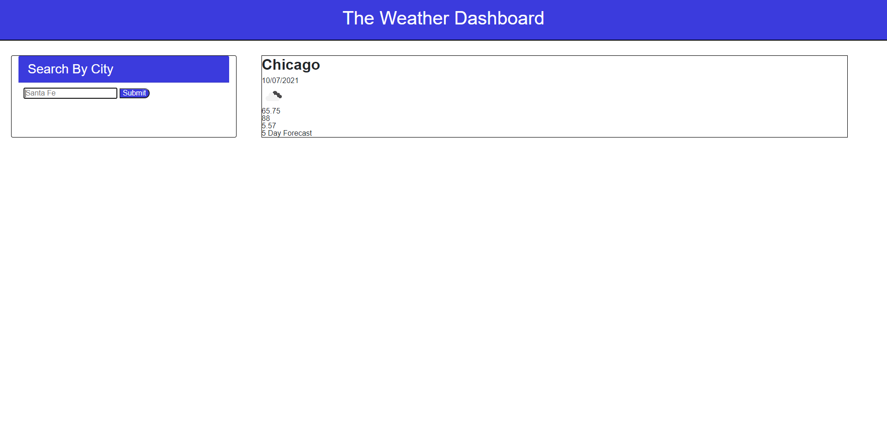

# 06 Server-Side APIs: Weather Dashboard

## My Task

 My challenge is to build a weather dashboard that will run in the browser and feature dynamically updated HTML and CSS.

I am using the [OpenWeather One Call API](https://openweathermap.org/api/one-call-api) to retrieve weather data for cities. 

## User Story

```
AS A traveler
I WANT to see the weather outlook for multiple cities
SO THAT I can plan a trip accordingly
```

## Acceptance Criteria

```
1. I have created a weather dashboard with search input forms.

2. When the user searches for a city, they are presented with current a current forecast as well as a 5 Day Forecast for that city.

3. The city is added to the search history as well.

4. Current weather conditions show the city name, the date, an icon represenation of weather conditions, the temperature, humidity, wind speed and the UV index.

5. The UV index is displayed with a color representation which indicates whether the conditions are favorable, moderate or severe.

6. The 5 Day Forecast displays the date, an icon representation of weather conditions, temperature, wind speed and humidity.

7. The user is also able to click on a city in the search history and is presented with the current and 5 Day Forecast for that city.

```

## Screen Shot

The following image shows the web application's appearance and functionality:



## Links 
GitHub Repo: https://github.com/chuck2076/Homework_6_Weather_Page_CRS
GitHub URL: https://chuck2076.github.io/Homework_6_Weather_Page_CRS/


